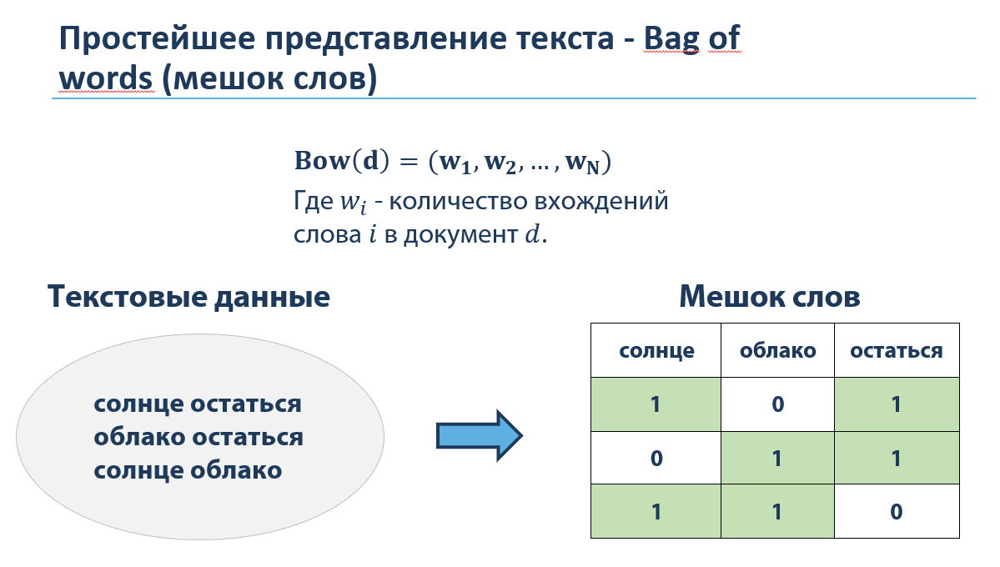
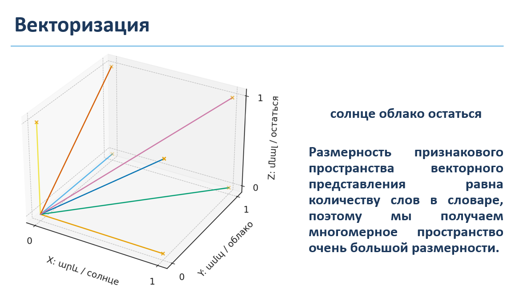
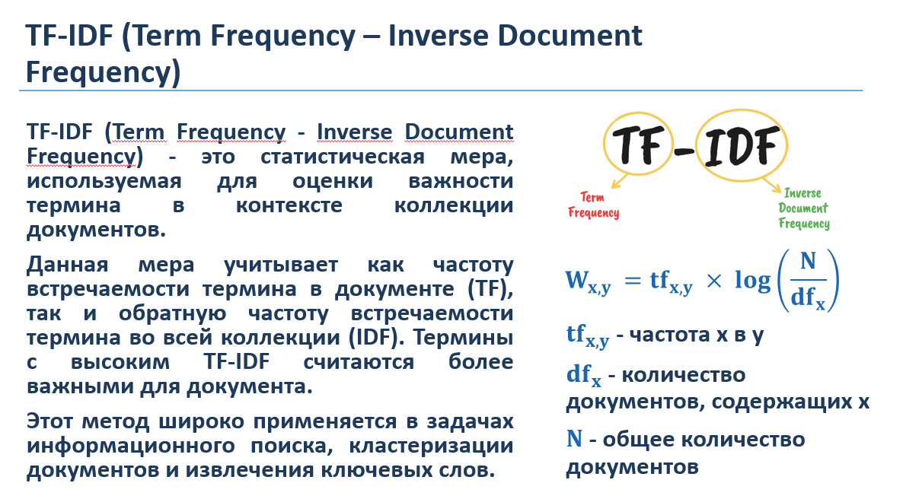
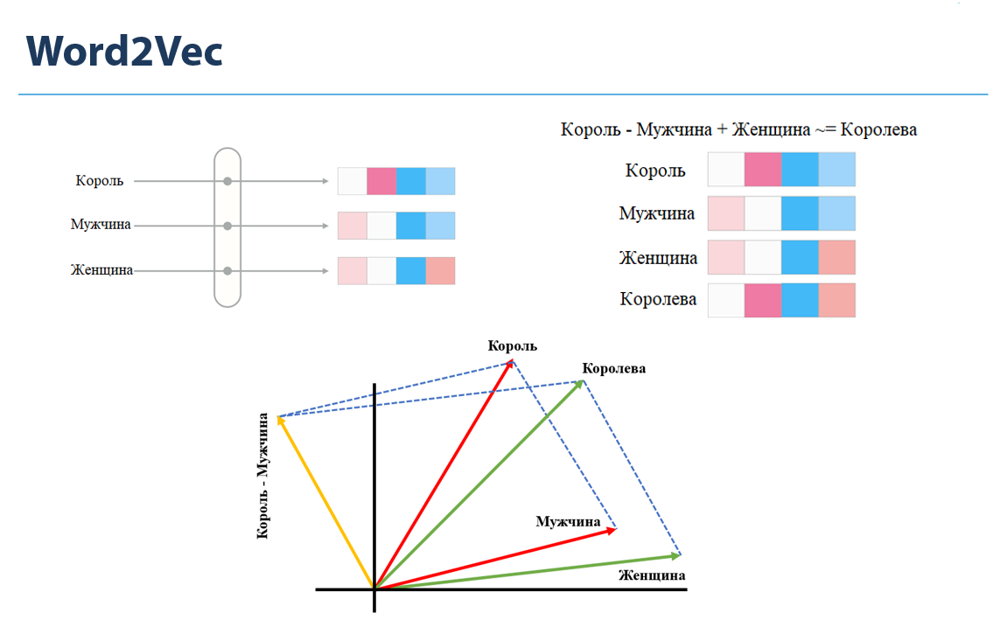

# NLP-микросервис на FastAPI

Учебный проект: **сервер** принимает тексты (в формате JSON) и возвращает результаты обработки текста.  
Есть **клиент**, который умеет вызывать все функции сервера и сохранять ответы в JSON-файлы.

---

## Что умеет сервер

### Работа с корпусом (список текстов)
- `POST /bag-of-words` - Bag of Words, реализован с помощью NumPy
- `POST /tf-idf` - TF‑IDF, реализован с помощью NumPy
- `POST /word2vec` - Word2Vec, реализован с помощью библиотеки gensim

### Работа с текстом
- `POST /text_nltk/tokenize` - разбить текст на слова
- `POST /text_nltk/stem` - стемминг (приведение слов к их основе)
- `POST /text_nltk/lemmatize` - лемматизация (начальная форма слова) с помощью библиотеки pymorphy2
- `POST /text_nltk/pos` - выделение частей речи с помощью библиотеки pymorphy2
- `POST /text_nltk/ner` - распознавание именованных сущностей

### Предобработка текстов по умолчанию
- приведение к нижнему регистру
- удаление пунктуации и цифр
- удаление стоп-слов

---

## Как это работает?

Кратко о том, что происходит внутри каждого метода.

### `/bag-of-words` — Bag of Words (NumPy)
Тексты очищаются, превращаются в слова, затем строится общий словарь.  
После этого считается, сколько раз каждое слово встретилось в каждом документе — получается матрица частот.




### `/tf-idf` — TF‑IDF (NumPy)
Сначала считается мешок слов. Затем:
- **TF** показывает, как часто слово встречается в конкретном документе;
- **IDF** повышает вес редких слов и понижает вес слишком частых.  
Итог: матрица важности слов для документов.



### `/word2vec` — Word2Vec (gensim)
Модель учится на последовательностях слов из корпуса и превращает каждое слово в набор чисел, вектор.  
Слова с похожим смыслом обычно получают похожие векторы.



## Структура проекта

```
nlp_fastapi/
  server/
    main.py      # эндпоинты FastAPI
    nlp.py       # логика обработки текста
  client/
    client.py    # клиент ко всем эндпоинтам
    text.txt     # пример корпуса
  requirements.txt
```

---

## Установка

Установка сторонних библиотек

```powershell
pip install -r requirements.txt
```

---

## Запуск сервера

Из корня проекта

```powershell
uvicorn server.main:app --host 127.0.0.1 --port 8000 --reload
```

Проверка

- в браузере: `http://127.0.0.1:8000/`
- или командой клиента: `python .\client\client.py health`

---

## Запуск клиента

Клиент читает корпус из `client/text.txt` и отправляет запросы на сервер.

### Мешок слов
```powershell
python .\client\client.py bow --detail full --print summary --save bow_full.json
```

### TF‑IDF
```powershell
python .\client\client.py tfidf --detail partial --top-n 40 --l2-normalize --save tfidf.json
```

### Word2Vec
```powershell
python .\client\client.py word2vec --detail partial --top-n 50 --vector-size 50 --epochs 10 --save w2v.json
```

### Обработка одного текста
```powershell
python .\client\client.py tokenize  --text "ТЕКСТ"
python .\client\client.py lemmatize --text "ТЕКСТ"
python .\client\client.py pos       --text "ТЕКСТ"
python .\client\client.py ner       --text "ТЕКСТ"
```

---

## Тип ответа

Для `/bag-of-words`, `/tf-idf`, `/word2vec` доступны параметры:
- `--detail full|partial` - полный или сокращённый ответ
- `--top-n N` - сколько слов оставить в режиме `partial`
- `--include-preprocessed` - вернуть токены после предобработки (может сильно увеличить JSON)

---
